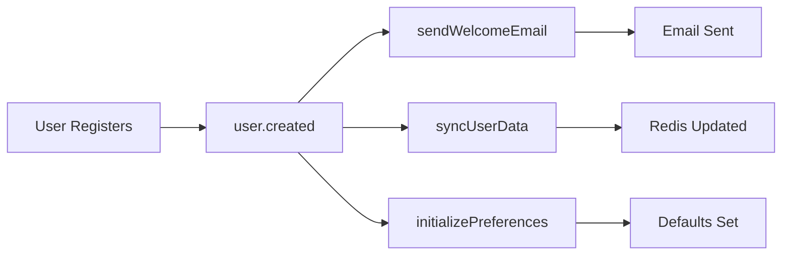
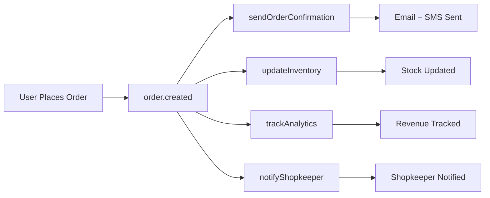
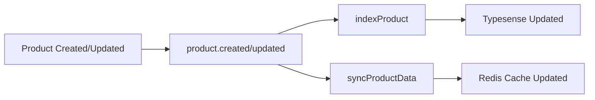

# Inngest Integration Architecture

## Overview

MohallaMart leverages [Inngest](https://www.inngest.com/) as its event-driven workflow orchestration platform to handle background jobs, async processes, and reliable task execution. This document explains how Inngest powers the platform's event-driven architecture, enabling scalable, fault-tolerant operations.

## Why Inngest?

- **Reliability**: Automatic retries, error handling, and durability for critical workflows
- **Observability**: Built-in monitoring, tracing, and debugging for all background jobs
- **Developer Experience**: Type-safe event definitions and step-by-step execution
- **Scalability**: Handles high-volume events without infrastructure overhead
- **Decoupling**: Separates business logic from execution concerns

## Architecture Principles

### Event-Driven Design

MohallaMart follows an event-driven architecture where user actions, system changes, and external triggers emit events that cascade through Inngest workflows:

```
User Action → Event Emission → Inngest Function → Business Logic → Side Effects
```

### Composite Workflows

Complex operations are broken into reusable event workflows that orchestrate multiple functions:

```
userRegistration = [userCreated, sendWelcomeEmail, syncUserData]
orderCreation = [orderCreated, sendOrderConfirmation, updateInventory, trackAnalytics]
productIndexing = [productCreated, indexProduct, syncProductData]
```

---

## Event Categories

MohallaMart organizes events into **8 core categories**, each responsible for a specific domain:

### 1. User Events (`userEvents`)

Handles user lifecycle operations:

| Event | Trigger | Purpose |
|-------|---------|---------|
| `user.created` | New user registration | Initialize user profile, send welcome email, sync to external systems |
| `user.updated` | Profile/settings change | Update user data across services, invalidate caches |
| `user.deleted` | Account deletion | Cleanup user data, notify dependent services |

**Workflow Example:**
```typescript
// When a user registers
await userEvents.created({
  userId: "user_123",
  email: "customer@example.com",
  name: "John Doe"
});
// Triggers: sendWelcomeEmail, syncUserData, initializePreferences
```

### 2. Order Events (`orderEvents`)

Manages order lifecycle and processing:

| Event | Trigger | Purpose |
|-------|---------|---------|
| `order.created` | New order placement | Send confirmation, update inventory, track revenue |
| `order.updated` | Status change (packed, shipped, delivered) | Notify customer, update tracking, sync with delivery partners |
| `order.cancelled` | Order cancellation | Refund processing, inventory restoration, analytics |

**Workflow Example:**
```typescript
// When an order is placed
await orderEvents.created({
  orderId: "ord_456",
  userId: "user_123",
  items: [...],
  total: 1250.00,
  shopId: "shop_789"
});
// Triggers: sendOrderConfirmation, updateInventory, trackAnalytics, notifyShopkeeper
```

### 3. Product Events (`productEvents`)

Handles product catalog changes:

| Event | Trigger | Purpose |
|-------|---------|---------|
| `product.created` | New product added | Index in search (Typesense), sync to cache (Redis) |
| `product.updated` | Price/stock/details change | Re-index search, invalidate caches, notify watchers |
| `product.outOfStock` | Inventory depleted | Alert shopkeeper, remove from active listings, notify interested users |

**Workflow Example:**
```typescript
// When a product goes out of stock
await productEvents.outOfStock({
  productId: "prod_101",
  shopId: "shop_789",
  lastStock: 0
});
// Triggers: processOutOfStockAlert, removeFromSearch, notifyShopkeeper
```

### 4. Notification Events (`notificationEvents`)

Centralized notification dispatch:

| Event | Trigger | Purpose |
|-------|---------|---------|
| `notification.send` | System/business event | Send push (OneSignal), SMS (Twilio/MSG91), email notifications |

**Supported Channels:**
- **Push**: OneSignal for app notifications
- **SMS**: Twilio/MSG91 for order updates
- **Email**: Transactional emails (welcome, order confirmation, reset password)

**Workflow Example:**
```typescript
// Send multi-channel notification
await notificationEvents.send({
  userId: "user_123",
  type: "order.delivered",
  channels: ["push", "sms"],
  data: {
    orderId: "ord_456",
    deliveredAt: new Date().toISOString()
  }
});
// Triggers: sendNotification → dispatches to OneSignal + Twilio
```

### 5. Analytics Events (`analyticsEvents`)

Tracks user behavior and business metrics:

| Event | Trigger | Purpose |
|-------|---------|---------|
| `analytics.track` | User interactions (page view, search, add-to-cart, purchase) | Aggregate metrics, generate reports, ML feature extraction |

**Tracked Metrics:**
- Page views, session duration
- Search queries, conversion rates
- Cart abandonment, checkout flow
- Revenue, order frequency, AOV

**Workflow Example:**
```typescript
// Track search conversion
await analyticsEvents.track({
  userId: "user_123",
  event: "search.converted",
  properties: {
    query: "organic vegetables",
    resultsCount: 12,
    clickedProduct: "prod_101",
    convertedToOrder: true
  }
});
// Triggers: trackAnalytics → writes to analytics DB, updates dashboards
```

### 6. Shopkeeper Events (`shopkeeperEvents`)

Manages shopkeeper onboarding and status:

| Event | Trigger | Purpose |
|-------|---------|---------|
| `shopkeeper.applied` | New shop application | Notify admin, initiate verification workflow |
| `shopkeeper.approved` | Application approved | Grant dashboard access, send onboarding email, enable shop |

**Workflow Example:**
```typescript
// When a shopkeeper is approved
await shopkeeperEvents.approved({
  shopkeeperId: "sk_999",
  shopId: "shop_789",
  approvedBy: "admin_001"
});
// Triggers: sendApprovalEmail, enableShopListing, syncShopData
```

### 7. Search Events (`searchEvents`)

Maintains Typesense search index:

| Event | Trigger | Purpose |
|-------|---------|---------|
| `search.index` | Product created/updated | Index in Typesense for fast search |

**Workflow Example:**
```typescript
// Index a new product
await searchEvents.index({
  productId: "prod_101",
  name: "Organic Tomatoes",
  category: "Vegetables",
  price: 60.00,
  shopId: "shop_789"
});
// Triggers: indexProduct → adds/updates in Typesense collection
```

### 8. Cleanup Events (`cleanupEvents`)

Maintains system hygiene:

| Event | Trigger | Purpose |
|-------|---------|---------|
| `cleanup.expiredSessions` | Scheduled (daily) | Remove expired auth sessions from Supabase |
| `cleanup.oldLogs` | Scheduled (weekly) | Archive/delete old logs, analytics data |

**Workflow Example:**
```typescript
// Daily session cleanup
await cleanupEvents.expiredSessions({
  olderThan: "7d" // Delete sessions older than 7 days
});
// Triggers: cleanupExpiredSessions → clears Supabase auth sessions
```

---

## Inngest Functions

MohallaMart defines **15+ Inngest functions** that respond to events. Each function uses `step.run` for idempotent, retryable execution.

### Core Functions

#### 1. `sendWelcomeEmail`
- **Event**: `user.created`
- **Purpose**: Send welcome email to new users
- **Steps**: Fetch user data → Render email template → Send via email service

#### 2. `sendOrderConfirmation`
- **Event**: `order.created`
- **Purpose**: Send order confirmation email and SMS
- **Steps**: Fetch order details → Render confirmation → Send email + SMS

#### 3. `indexProduct`
- **Event**: `search.index`
- **Purpose**: Add/update product in Typesense search index
- **Steps**: Fetch product data → Format for Typesense → Upsert document

#### 4. `cleanupExpiredSessions`
- **Event**: `cleanup.expiredSessions`
- **Purpose**: Remove expired auth sessions
- **Steps**: Query Supabase for old sessions → Delete in batches

#### 5. `sendNotification`
- **Event**: `notification.send`
- **Purpose**: Dispatch notifications to OneSignal/Twilio/MSG91
- **Steps**: Parse notification payload → Route to channel (push/SMS/email) → Send + track delivery

#### 6. `trackAnalytics`
- **Event**: `analytics.track`
- **Purpose**: Write analytics events to database
- **Steps**: Validate event → Write to Convex analytics table → Update aggregates

#### 7. `processOutOfStockAlert`
- **Event**: `product.outOfStock`
- **Purpose**: Alert shopkeeper and remove from search
- **Steps**: Notify shopkeeper → Remove from Typesense → Log to inventory system

#### 8. `syncUserData`
- **Event**: `user.created`, `user.updated`
- **Purpose**: Sync user data to Redis cache and external systems
- **Steps**: Fetch user profile → Update Redis → Sync to CRM (if configured)

#### 9. `syncProductData`
- **Event**: `product.created`, `product.updated`
- **Purpose**: Sync product data to Redis and search
- **Steps**: Fetch product → Update Redis cache → Trigger search reindex

#### 10. `syncOrderData`
- **Event**: `order.created`, `order.updated`
- **Purpose**: Sync order data to external systems (accounting, delivery partners)
- **Steps**: Fetch order → Format for external API → Send to partners

---

## Composite Workflows

### User Registration Flow



**Triggered Functions:**
1. `sendWelcomeEmail` - Welcome email with account setup guide
2. `syncUserData` - Cache user profile in Redis
3. `initializePreferences` - Set default location, language, notification preferences

### Order Creation Flow



**Triggered Functions:**
1. `sendOrderConfirmation` - Order confirmation email + SMS
2. `updateInventory` - Decrement stock for ordered items
3. `trackAnalytics` - Record revenue, conversion, AOV
4. `notifyShopkeeper` - Push notification to shopkeeper app

### Product Indexing Flow



**Triggered Functions:**
1. `indexProduct` - Add/update in Typesense for search
2. `syncProductData` - Update Redis cache for fast retrieval

---

## Error Handling & Retries

Inngest provides automatic retry logic for failed functions:

- **Default Retry Policy**: 3 retries with exponential backoff (1s, 5s, 15s)
- **Custom Retry**: Functions can override retry count and delay
- **Dead Letter Queue**: Failed events after max retries are logged for manual review

**Example:**
```typescript
export const sendOrderConfirmation = inngest.createFunction(
  {
    id: "send-order-confirmation",
    retries: 5, // Override default 3 retries
  },
  { event: "order.created" },
  async ({ event, step }) => {
    // Idempotent steps with automatic retries
    await step.run("send-email", async () => {
      // If this fails, Inngest retries automatically
      await emailService.send({ to: event.data.email, ... });
    });
  }
);
```

---

## Step-Based Execution

Inngest functions use `step.run` to break logic into discrete, idempotent steps:

**Benefits:**
- **Partial Progress**: If step 2 fails, step 1 doesn't re-run
- **Debugging**: See which step failed in the Inngest dashboard
- **Retries**: Only failed steps are retried, not the entire function

**Example:**
```typescript
export const processOrder = inngest.createFunction(
  { id: "process-order" },
  { event: "order.created" },
  async ({ event, step }) => {
    // Step 1: Charge payment
    const payment = await step.run("charge-payment", async () => {
      return await razorpay.charge(event.data.orderId);
    });

    // Step 2: Update inventory (only runs if step 1 succeeds)
    await step.run("update-inventory", async () => {
      await convex.mutation(api.orders.updateInventory, {
        orderId: event.data.orderId,
      });
    });

    // Step 3: Send confirmation (only runs if steps 1-2 succeed)
    await step.run("send-confirmation", async () => {
      await emailService.send({ to: event.data.email, ... });
    });
  }
);
```

---

## Integration Points

### Convex (Database)

Inngest functions read/write to Convex for persistent state:

```typescript
// Read data
const user = await convex.query(api.users.get, { userId: event.data.userId });

// Write data
await convex.mutation(api.orders.create, { orderId, items, total });
```

### Typesense (Search)

Products are indexed in Typesense for fast search:

```typescript
await typesenseClient.collections("products").documents().upsert({
  id: product.id,
  name: product.name,
  category: product.category,
  price: product.price,
});
```

### Redis (Cache)

Frequently accessed data is cached in Redis:

```typescript
await redis.setex(`user:${userId}`, 3600, JSON.stringify(userData));
```

### OneSignal (Push Notifications)

Push notifications are sent via OneSignal:

```typescript
await oneSignal.createNotification({
  app_id: process.env.NEXT_PUBLIC_ONESIGNAL_APP_ID,
  include_player_ids: [event.data.userId],
  contents: { en: "Your order has been delivered!" },
});
```

### Twilio/MSG91 (SMS)

Transactional SMS for order updates:

```typescript
await twilio.messages.create({
  to: event.data.phone,
  from: process.env.TWILIO_PHONE_NUMBER,
  body: `Your order #${orderId} is on the way!`,
});
```

---

## Monitoring & Observability

### Inngest Dashboard

Access real-time monitoring at `https://app.inngest.com`:

- **Function Runs**: View all executions, success/failure rates
- **Event History**: Trace event flow through workflows
- **Step Details**: Debug failed steps with logs and stack traces
- **Metrics**: Latency, throughput, error rates

### Local Development

Use Inngest Dev Server for local testing:

```bash
npx inngest-cli dev
```

Opens `http://localhost:8288` with:
- Event replay
- Function testing
- Step-by-step debugging

### Production Deployment

Inngest automatically discovers functions at:

```
/api/inngest
```

**Deployment Steps:**
1. Deploy Next.js app to Vercel/production
2. Inngest syncs functions from `/api/inngest`
3. Events flow to production functions

---

## Best Practices

### 1. Idempotent Steps

Always design steps to be safely retryable:

```typescript
// Good: Check if already processed
await step.run("send-email", async () => {
  const sent = await db.query.emailLog.findFirst({
    where: { orderId: event.data.orderId }
  });
  if (sent) return; // Skip if already sent
  await emailService.send({ ... });
});
```

### 2. Event Payload Design

Keep event payloads minimal, pass IDs instead of full objects:

```typescript
// Good: Pass ID, fetch in function
await orderEvents.created({ orderId: "ord_456" });

// Bad: Pass full object
await orderEvents.created({ order: { /* 100 fields */ } });
```

### 3. Error Handling

Use try-catch for graceful degradation:

```typescript
await step.run("send-sms", async () => {
  try {
    await twilio.messages.create({ ... });
  } catch (error) {
    // Log error but don't fail the function
    console.error("SMS failed:", error);
    // Email as fallback
    await emailService.send({ ... });
  }
});
```

### 4. Batching

For high-volume events, batch operations:

```typescript
await step.run("batch-index", async () => {
  const products = await fetchPendingProducts();
  await typesense.collections("products").documents().import(products);
});
```

---

## Environment Variables

Required for Inngest integration:

```env
# Inngest
INNGEST_EVENT_KEY=your_inngest_event_key
INNGEST_SIGNING_KEY=your_inngest_signing_key # Production only

# Service Integrations (used by Inngest functions)
NEXT_PUBLIC_ONESIGNAL_APP_ID=your_onesignal_app_id
ONESIGNAL_REST_API_KEY=your_onesignal_rest_api_key
TWILIO_ACCOUNT_SID=your_twilio_account_sid
TWILIO_AUTH_TOKEN=your_twilio_auth_token
TYPESENSE_API_KEY=your_typesense_api_key
REDIS_URL=your_redis_url
```

---

## Development Workflow

### 1. Define Event

Add to `src/lib/inngest/events.ts`:

```typescript
export const myFeatureEvents = {
  actionPerformed: (data: { featureId: string }) =>
    inngest.send({
      name: "feature.action",
      data,
    }),
};
```

### 2. Create Function

Add to `src/lib/inngest/functions.ts`:

```typescript
export const handleFeatureAction = inngest.createFunction(
  { id: "handle-feature-action" },
  { event: "feature.action" },
  async ({ event, step }) => {
    await step.run("process-action", async () => {
      // Your logic here
    });
  }
);
```

### 3. Emit Event

In your application code:

```typescript
import { myFeatureEvents } from "@/lib/inngest/events";

// In API route or server action
await myFeatureEvents.actionPerformed({ featureId: "feat_123" });
```

### 4. Test Locally

```bash
# Terminal 1: Start Next.js
npm run dev

# Terminal 2: Start Inngest Dev Server
npx inngest-cli dev
```

Navigate to `http://localhost:8288` to see events and functions.

---

## Production Checklist

- [ ] Set `INNGEST_SIGNING_KEY` in production environment
- [ ] Enable function versioning in Inngest dashboard
- [ ] Configure alerts for failed functions (Slack/email)
- [ ] Set up monitoring dashboards for key metrics
- [ ] Test event replay for critical workflows
- [ ] Document custom retry policies for critical functions
- [ ] Review error logs weekly
- [ ] Enable rate limiting for high-volume events

---

## Troubleshooting

### Functions Not Triggering

1. Check Inngest Dev Server is running (`npx inngest-cli dev`)
2. Verify `/api/inngest` endpoint is accessible
3. Check event name matches function trigger

### Step Failures

1. View step logs in Inngest dashboard
2. Check service credentials (Twilio, OneSignal, etc.)
3. Review error stack traces
4. Test locally with event replay

### Performance Issues

1. Review function execution times in dashboard
2. Add batching for high-volume operations
3. Cache frequently accessed data
4. Use step parallelism where possible

---

## Resources

- **Inngest Docs**: https://www.inngest.com/docs
- **MohallaMart Setup Guide**: [INNGEST_SETUP.md](./INNGEST_SETUP.md)
- **Event Definitions**: [src/lib/inngest/events.ts](./src/lib/inngest/events.ts)
- **Function Implementations**: [src/lib/inngest/functions.ts](./src/lib/inngest/functions.ts)

---

## Summary

Inngest powers MohallaMart's background operations with:

- **8 event categories** for organized workflow orchestration
- **15+ functions** handling user lifecycle, orders, search, analytics, cleanup
- **Composite workflows** for complex multi-step operations
- **Step-based execution** for reliability and debugging
- **Automatic retries** with exponential backoff
- **Built-in monitoring** for observability

This architecture enables MohallaMart to scale reliably while maintaining fast, responsive user experiences.

---

**Built with ❤️ by the MohallaMart Team**
